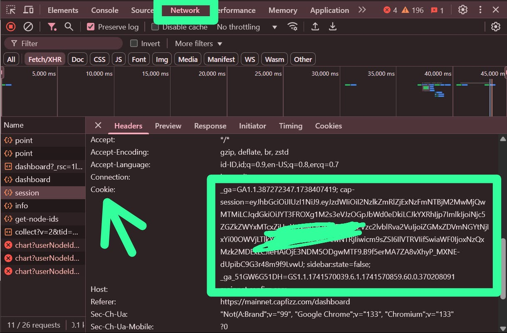

# Capfizz Sentry Node BOT
Capfizz Sentry Node BOT

- Register Here : [Capfizz Sentry Node](https://mainnet.capfizz.com/register?ref=Y8PHHK)
- Use Code: Y8PHHK

## Features

  - Auto Get Account Information
  - Auto Run With [Monosans](https://raw.githubusercontent.com/monosans/proxy-list/main/proxies/all.txt) Proxy - Choose 1
  - Auto Run With Private Proxy - Choose 2
  - Auto Run Without Proxy - Choose 3
  - Auto Send Ping Every 1 Minutes
  - Multi Nodes For Each Accounts
  - Multi Accounts With Threads

## Requiremnets

- Make sure you have Python3.9 or higher installed and pip.

## Instalation

1. **Clone The Repositories:**
   ```bash
   git clone https://github.com/amumuku/Capfizz-BOT.git
   ```
   ```bash
   cd Capfizz-BOT
   ```

2. **Install Requirements:**
   ```bash
   pip install -r requirements.txt #or pip3 install -r requirements.txt
   ```

## Configuration

### Screenshots

<div style="text-align: center;">
  <h4><strong>Cookie String Data</strong></h4>
  
</div>

- **cookies.txt:** You will find the file `cookies.txt` inside the project directory. Make sure `cookies.txt` contains data that matches the format expected by the script. Here are examples of file formats:
  ```bash
  your_cookie_data_1
  your_cookie_data_2
  ```

- **proxy.txt:** You will find the file `proxy.txt` inside the project directory. Make sure `proxy.txt` contains data that matches the format expected by the script. Here are examples of file formats:
  ```bash
  ip:port # Default Protcol HTTP.
  protocol://ip:port
  protocol://user:pass@ip:port
  ```

## Run

```bash
python bot.py #or python3 bot.py
```

- **SOL:** E1xkaJYmAFEj28NPHKhjbf7GcvfdjKdvXju8d8AeSunf
- **SUI:** 0xa03726ecbbe00b31df6a61d7a59d02a7eedc39fe269532ceab97852a04cf3347

Thank you for visiting this repository, don't forget to contribute in the form of follows and stars.
If you have questions, find an issue, or have suggestions for improvement, feel free to contact me or open an *issue* in this GitHub repository.

**vonssy**
